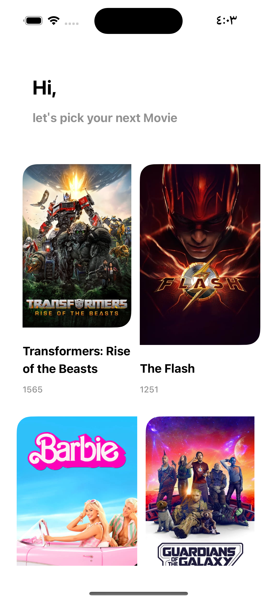
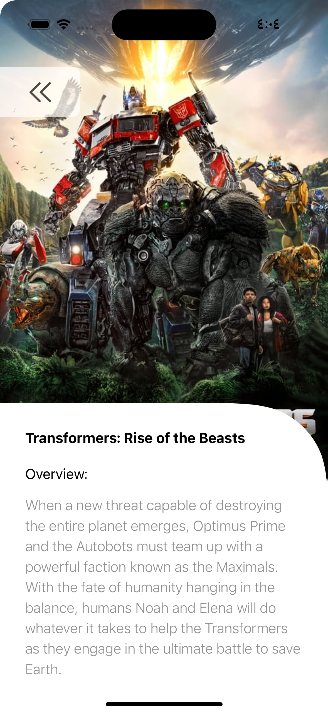
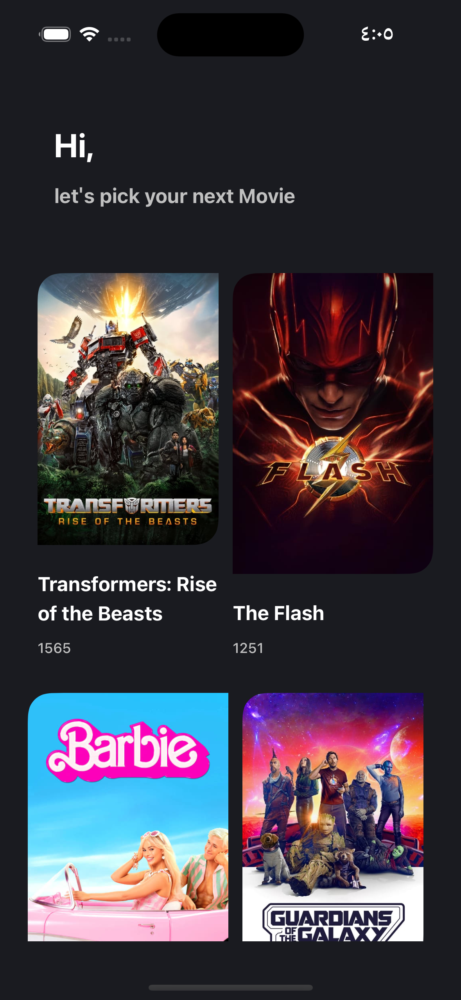
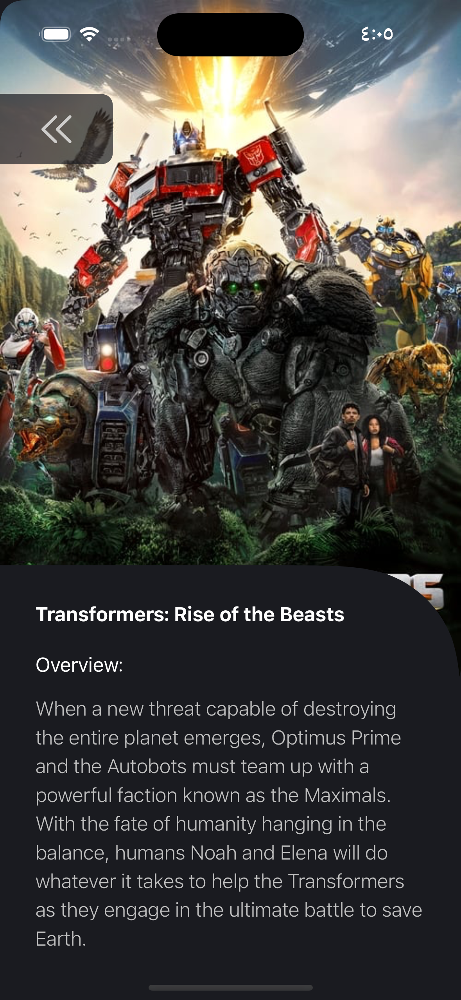
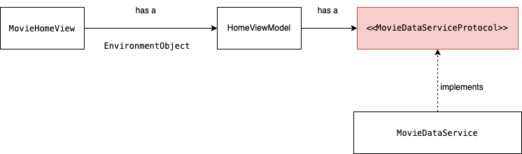

# YassirChallengeTask
iOS Movie App written in SwiftUI using MVVM

## Requirements
- iOS Target 16.4+
- Xcode 14.0+
- Swift 5.0

## ScreenShots 

| List | Details | List[Dark mode] | Details[Dark mode] |
| :-: | :-: | :-: | :-: |
|  |  |  | 

## Libraries

* [**Arkana**](https://github.com/rogerluan/arkana): Arkana is used to store keys and secrets away from source code

## Installation

* Clone the project.
* add .env file on the project's root, .env file contains the movieApiKey[will be shared over the email]
* Run `bundle exec arkana` this command to create dependencies folder
* <b>Adding a local Swift Package to your Xcode project</b>: Choose <kbd>File</kbd> → <kbd>Add Packages…</kbd> and click on <kbd>Add Local…</kbd>. Locate and select the `YassirKeys` folder
* Run the project

## Credits
* [**App Icon**](https://icons8.com/icons/set/movie-apps)

## Example of UML For Home View
 

## Author

* [**Hager Elsayed**](https://github.com/HagerElsayed)
